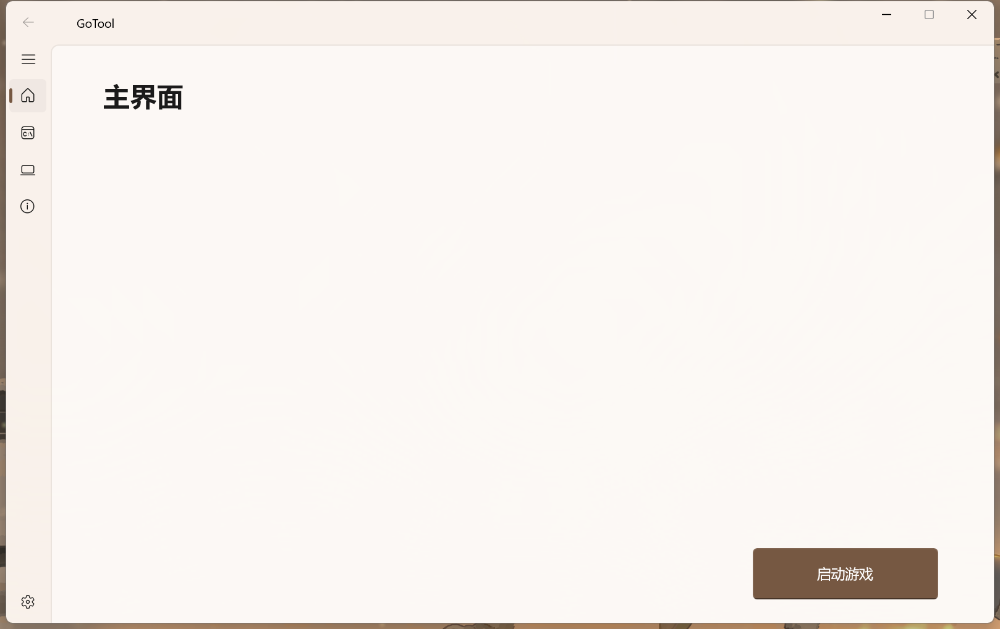
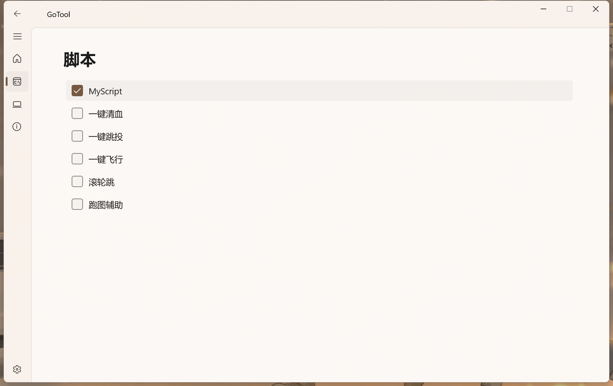
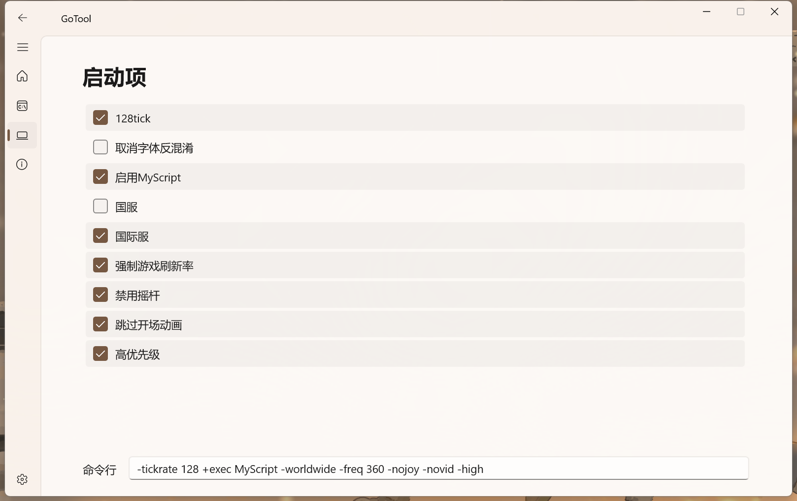

# GoTool

## 介绍

这是一款能够为你方便管理你的CSGO脚本的管理软件，在陆陆续续经过一年的开发之后程序已经是相对来说较为完善了，在v3.3版本发布之后，软件进入无限期的停更状态（无论Windows App SDK是否更新，软件是否出现bug），感谢每一位支持我的用户！😊

软件部分截图





## 下载

1. [蓝奏云](https://wwra.lanzouf.com/iYSx90v6tztg)
2. [阿里云盘](http://www.aliyundrive.com/s/gbyMPzR3cDr)（目前已停用，仅供老版本下载）

## 更新日志

### v3.3-2023.05.03

1. 除脚本管理程序外所有脚本程序使用WinRT C++重写，运行需要WAS环境（MyScript更名为脚本管理🥰）
2. 规范了项目文件目录，因脚本程序重写故不再使用老版本Video播放组件
3. 现阶段已经放弃使用老版本启动项参数的方式启动脚本程序

- 脚本管理程序不会再考虑重写了，主要是个人认为现阶段程序已经相对来说较为完善了

### v3.2-2023.04.09

1. 开始使用WinRT C++重写脚本程序（Windows App SDK老版本的bug使这个版本被迫停止开发）

### v3.1-2023.01.15

1. 修复了标题栏右边部分无法拖动以及返回按钮部分按不到的问题（加入了关于DPI的算法）
2. 所有界面的组件错位问题均已修复

- 依旧是标题栏字体颜色以及控制按钮颜色在暗色模式下依旧为黑色，暂时没有想到解决方案（其实是懒😴）

### v2.9-2022.12.01

1. 使用C#进行了全部代码的重构，界面库采用WinUI3，在Win10及以上环境中能够正常运行
2. 因为使用了WinUI，现在软件已经支持自由变换颜色模式，也可以随系统变换颜色模式（强烈安利AutoDarkMode❤️）
3. 脚本依旧沿用旧版内容，后续可能会考虑开放一个提交通道
4. 启动项新增了一个编辑框供复制启动项到Steam使用（因为我自己也不会使用这个软件来启动CSGO😂）
5. 删除了托盘图标的功能，因为确实用处不大
6. 删除了自动搜寻的功能，因为DocumentSearch功能有限且效率低下，如果后期还会更新自动搜寻可能会考虑类Everything的搜寻方式

- 已知左上角的返回按钮在高DPI下会出现右边的上半部分按不到的情况，这是因为WinUI的自定义标题会出现控件遮挡的问题，虽然添加了代码重新定义了标题栏的宽度高度，但是仅限于在1920x1080的分辨率下能够正常使用，在更高的DPI下依旧会出现标题栏遮挡的问题，下一个版本可能会考虑更新获取DPI的算法
- 已知导航栏展开后，界面会出现错位的情况，这是因为控件我直接用的像素定位的方法，没有明确地分割界面，下个版本更新会修复这个问题
- 已知标题栏字体颜色以及控制按钮颜色在暗色模式下依旧为黑色，暂时不知道是否是因为手动切换还是自定义标题栏出现的问题，下一个版本可能会修复
- Video播放组件依旧使用旧版本组件，后期应该也不会使用C#重构
- 脚本程序依旧使用旧版本程序，后期应该也不会使用C#重构（旧版本不支持高DPI，但是太懒了😏）

### v2.5-2022.09.11

1. 采用Exdui3.0重绘新界面，界面遵循Micrsoft FluentUI标准，导航栏以及按钮等主题文件详见[Exdui WinUI](https://gitee.com/ChenYiLinS/exdui-WinUI )（原名：Exdui FluentUI，此模块包含了Win11窗口圆角和阴影）目前暂未测试Win11以下系统是否能正常启用窗口阴影，但安装包提供了Win11的“dwmapi”DLL组件的安装以供实现可能的Win10支持。同时窗口模糊功能依旧通过从Win10就开放的API实现系统级模糊效果

   关于圆角函数的调用文档："[在 Windows 11 的桌面应用中应用圆角](https://docs.microsoft.com/zh-cn/windows/apps/desktop/modernize/apply-rounded-corners)"

2. 提供了自定义脚本功能，代码大部分未沿用2.5之前的版本。所有的脚本项目提供了单独的程序供生成脚本，提供单独的程序会自带演示视频（包含在程序目录\VideoRes文件夹下），脚本开发详见后文脚本开发标准

3. 提供自定义启动项功能，类似脚本，软件内已开放启动项程序接口，可借由启动项程序生成启动项

4. CSGO目录的搜寻已经重写部分逻辑，正常的搜寻或停止搜寻已无恶性Bug，以及开放了手动选择目录的功能（终于不再反人类了）

5. 开放了开机启动以及缩小到托盘的功能（虽然用处不大😥）

- MyScript脚本提供了将多个cfg脚本整合在一个cfg脚本的功能
- 一键清血脚本提供了绑定多种功能，如检视、开火、下蹲
- 修复了自动搜寻停止按钮按下依旧会继续搜寻占用CPU的Bug
- 修复了自动搜寻无法以正常状态进行二次搜寻的Bug
- 取消了寻找CSGO路径会通过Steam启动CSGO获取进程路径的功能，改为硬盘直接搜索
- 主程序已经托盘程序都通过UPX压缩，但脚本程序因为调用了[Exdui WinUI](https://gitee.com/ChenYiLinS/exdui-WinUI)的信息框，导致不得不引入EXUI的支持库文件（Exdui WinUI的信息框由EXUI绘制详见”Exdui WinUI“文档）因此脚本程序因为UI库的原因导致体积庞大
- Video播放组件使用了WindowsPlayer的组件，导致无法静态编译和进行有效的压缩，因此Video播放组件体积也很庞大
- 已知自动搜寻功能在停止搜寻后任有部分线程会无法销毁，导致程序累计占用CPU资源的Bug，目前没有找到合适的解决方案，可通过减少多次启用和停止的次数避免此Bug（应该也不会有人狂按按钮几十次😂）

### v2.1-2022.05.19

1. 新增线程启动搜寻功能，避免搜寻时程序无响应
2. 修复了程序在没有“Plugin”文件夹出现脚本启用错误的bug
3. 新增搜寻按钮再次点击关闭搜寻功能
### V2.0-2022.05.18
1. 按照V1.0 UI，使用Exdui3.0重写编写，增加窗口界面动效，运行效率更高
2. 引入微软最新Win3 API，使用API绘制窗口圆角、窗口阴影以及窗口亚克力效果（窗口圆角和阴影仅支持Win11系统，亚克力效果支持Win10及以上系统）[亚克力效果在窗口重叠时会出现卡顿的情况，可通过关闭窗口移动预览解决]
3. UI使用自己编写的第三方Exdui组件，源码见我”Exdui FluentUI“仓库（窗口圆角和阴影引用都在此模块内），导航栏使用组件拼接的方式效率欠佳，后续更新会使用绘制的方式
4. 重写了寻找代码，采用多线程设计，效率高效。且彻底改变之前版本路径寻找在CSGO位置不在Steam的common路径时出现的问题，关于”DocumentSearch“模块源码见我”DocumentSearch“仓库
5. 准备更新配置文件管理功能，但V2.0代码比较混乱，将更新延后
6. 脚本管理功能开放，但功能没有写完，待后续更新
7. 编译重新使用黑月编译，减小程序体积
### V1.0-2022.03.30
1. UI彻底重写，遵循微软最新Fluent UI标准
### V0.5-Beta5-2022.03.27
1. 依旧是更新路径寻找方式，现在CSGO和Steam分别用Beta4的双模式分开寻找[Beta4的寻找方式经测试在CSGO位置不在Steam的common路径时会出现无法启动游戏的错误]
2. 寻找路径时延时结束CSGO，避免出现Steam启动错误代码[出现错误代码不影响游戏但是不美观]
### V0.4-Beta4-2022.03.25
1. 又双叒叕更新CSGO路径寻找方式[采用双模式寻找，更可靠]
### V0.3-Beta3-2022.03.20
1. 修复了无法找到CSGO路径的bug[Beta2沿用注册表寻找路径，经测试无法在每一台机器上通用]
2. 规范命名方式
### V0.2-Beta2-2022.03.19
1. 重写代码，部分逻辑性代码沿用上一个版本
2. 界面UI更新，使用图标作功能说明
3. 新增控制台输出显示
### V0.1-Beta1-2022.03.16
1. 增加自动寻找路径功能
2. 增加脚本自动启用功能
3. 脚本功能增加:(1)服务器设置功能
### V0.0.2-Alpha2-2022.03.16
1. 代码重建
2. 增加启动功能
3. 重写脚本启用逻辑，增加脚本自动启用功能[经测试，暂不可用]
4. 脚本功能增加:(1)跳过开头动画 (2)停用视角抖动 (3)一键跳投 (4)一键清血 (5)滚轮跳 (6)服务器设置功能[经测试，暂不可用]

## 关于Source文件夹的使用
Source文件夹下“源码+_Src”是由"e2txt"生成的文本代码，此文件夹由[e2txtSwitch](https://gitee.com/ChenYiLinS/e2txt-switch)生成。可直接查看修改，并由"e2txt"重新生成为后缀为".e"的易语言工程

## 如何开发属于你的脚本程序（开发标准）

***如果你也是一名开发者，无论你使用任何编程语言，都欢迎你加入到这个程序的开发中***（因为程序开放的接口理论上可以适用于任一编程语言！）

#### 1.文件构成

首先以“一键跳投”脚本作为例子，整个文件夹由几个文件构成（文件夹名即为脚本在主程序中显示的名字）

- Config.ini		//配置文件，记录了脚本的名字、脚本启用状态、脚本cfg文件的名字以及程序本身所需要记录的东西（如快捷按键）
- JumpThrow.cfg 		//脚本文件，当脚本在被主程序启用时，会被粘贴到CSGO目录的脚本目录下（csgo\cfg\）
- Console.exe		//脚本生成和修改的程序

#### 2.主程序是如何启动Console.exe

```c
运行 (取运行目录 () ＋ “\Script\” ＋ 全_列表_脚本 [集_启动窗口_页面2_列表.现行选中项 ()] ＋ “\Console.exe ” ＋ 到文本 (集_句柄_窗口) ＋ “ ” ＋ 到文本 (集_窗口_遮罩窗口.取窗口句柄 ()), 假, )
```

通过启动代码我们可以看到，在运行“Console.exe”的时候向程序附加了两个启动项，一个是主程序本身窗口的句柄，其次是在启用了模糊效果时候才会发送的遮罩窗口的句柄

C#通过以下代码取命令行参数

```c#
public static int Main(string[] args)
{
}
```

Cpp通过以下代码取命令行参数

```c++
int main(int argc, char* argv[]) 
{
}
```

Python通过以下代码取命令行参数

```python
import sys
```

**主程序窗口句柄作用：**

*1.在启动程序时*

```c
如果真 (取数组成员数 (全_命令行) ≥ 1)
   EnableWindow (到整数 (全_命令行 [1]), 假)
```

通过[Enablewindow](https://baike.baidu.com/item/EnableWindow/6372231)函数禁用主程序窗口的鼠标和键盘操作

*2.在程序即将被销毁时*

```c
EnableWindow (到整数 (全_命令行 [1]), 真)
' SetActiveWindow (到整数 (全_命令行 [1])) ' 测试代码
SetForegroundWindow (到整数 (全_命令行 [1]))
```

通过[Enablewindow](https://baike.baidu.com/item/EnableWindow/6372231)函数恢复主程序窗口的鼠标和键盘操作

通过[SetForegroundwindow](https://baike.baidu.com/item/SetForegroundWindow/6376711)函数将主程序窗口的位置设置为顶层并激活

**遮罩窗口句柄作用：**

*在程序即将被销毁时*

```c
SendMessageW (到整数 (全_命令行 [2]), 16, 0, 0)
```

通过[SendMessageW](https://baike.baidu.com/item/SendMessage/6374103)函数关闭遮罩窗口

#### 3.cfg脚本文件写出

xxx.cfg脚本文件写出到与程序同一目录即可，注意！cfg脚本文件名必须与"Config.ini"配置文件内Cmd项保持一致

#### 4.如果我需要调用视频演示

```c
运行 (局_父目录 ＋ “VideoRes\Video.exe ” ＋ 局_父目录 ＋ “VideoRes\Video_JumpThrow.mp4”, 真, )
```

"Video.exe"可直接通过附加视频路径的启动项来达到播放视频的目的，而视频文件建议存放在"VideoRes"文件夹下，且建议使用"Video_xxx"的命名规范

#### 5.我没有脚本生成程序如何添加单文件脚本

目录构成与有脚本生成程序的脚本相同，直接在目录下放置"xxx.cfg"即可

## 如何开发你的启动项

开发标准与脚本标准完全一致，主程序包括了启动项生成程序的运行接口

```c
运行 (取运行目录 () ＋ “\Mscfg\” ＋ 全_列表_启动项 [集_启动窗口_页面3_列表.现行选中项 ()] ＋ “\Console.exe ” ＋ 到文本 (集_句柄_窗口) ＋ “ ” ＋ 到文本 (集_窗口_遮罩窗口.取窗口句柄 ()), 假, )
```

只是由脚本的".cfg"变为".txt"文件

## 开发计划

- [x] 最基础的脚本启用
- [x] 直接启动游戏，无需手动启用脚本
- [x] UI改造
- [ ] CSGO配置文件导入导出功能
- [ ] CSGO配置文件管理系统
- [x] 自定义导入脚本
- [x] 脚本管理系统

## 关于Bug反馈
1. 通过小黑盒联系我(ID:16538055 昵称:陈翼霖)
2. 通过B站联系我(UID:107146424 昵称:陈翼霖)
3. 直接添加我的QQ:2317199736(最好是通过方式1或2)

## 项目所引用模块和内容（致以感谢！）

- Exdui（引用版本：3.0.15.510）
- [精易模块](http://ec.125.la/)（引用版本：10.1.0）
- [Exdui WinUI](https://gitee.com/ChenYiLinS/exdui-WinUI)（引用版本：1.3）
- DocumentSearch（引用版本：1.3）
- [WinUI](https://docs.microsoft.com/zh-cn/windows/apps/winui/)
- [e2txt](https://bbs.125.la/forum.php?mod=viewthread&tid=14649894)（引用版本：1.2）

## 支持我（也欢迎你白嫖）

用爱发电，欢迎支持！ :kissing_closed_eyes: 
