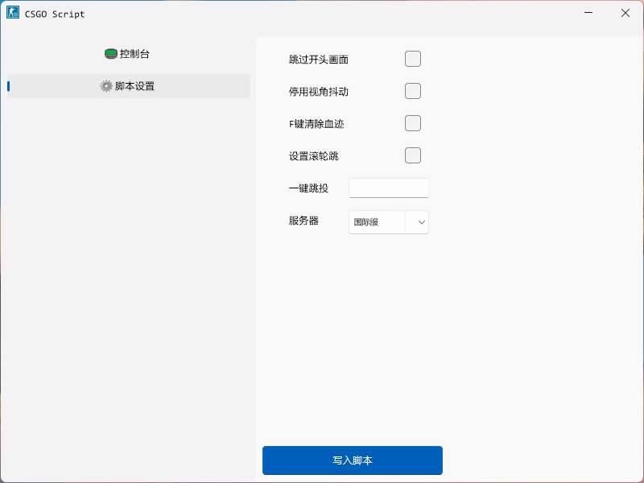

# CSGO Script

## 介绍
CSGO脚本管理软件

## 下载
1. [蓝奏云](http://wwn.lanzouq.com/i862H02c1n1a)
2. [阿里云盘](http://www.aliyundrive.com/s/VqVsLuzDjwX)

## 更新日志

### V1.0-2022.03.30
1. UI彻底重写，遵循微软最新Fluent UI标准
### V0.5-Beta5-2022.03.27
1. 依旧是更新路径寻找方式，现在CSGO和Steam分别用Beta4的双模式分开寻找[Beta4的寻找方式经测试在CSGO位置不在Steam的common路径时会出现无法启动游戏的错误]
2. 寻找路径时延时结束CSGO，避免出现Steam启动错误代码[出现错误代码不影响游戏但是不美观]
### V0.4-Beta4-2022.03.25
1. 又双叒叕更新CSGO路径寻找方式[采用双模式寻找，更可靠]
### V0.3-Beta3-2022.03.20
1. 修复了无法找到CSGO路径的bug[Beta2沿用注册表寻找路径，经测试无法在每一台机器上通用]
2. 规范命名方式
### V0.2-Beta2-2022.03.19
1. 重写代码，部分逻辑性代码沿用上一个版本
2. 界面UI更新，使用图标作功能说明
3. 新增控制台输出显示
### V0.1-Beta1-2022.03.16
1. 增加自动寻找路径功能
2. 增加脚本自动启用功能
3. 脚本功能增加:(1)服务器设置功能
### V0.0.2-Alpha2-2022.03.16
1. 代码重建
2. 增加启动功能
3. 重写脚本启用逻辑，增加脚本自动启用功能[经测试，暂不可用]
4. 脚本功能增加:(1)跳过开头动画 (2)停用视角抖动 (3)一键跳投 (4)一键清血 (5)滚轮跳 (6)服务器设置功能[经测试，暂不可用]

## 关于Source文件夹的使用
Source文件夹下是由"E2txt"生成的文本代码，可直接查看修改，并由"E2txt"重新生成为后缀为".e"的易语言工程

## 开发计划
- [x] 最基础的脚本启用
- [x] 直接启动游戏，无需手动启用脚本
- [x] UI改造
- [ ] CSGO配置文件导入导出功能
- [ ] CSGO配置文件管理系统
- [ ] 自定义导入脚本
- [ ] 脚本管理系统

## 关于Bug反馈
1. 通过小黑盒联系我(ID:16538055 昵称:陈翼霖)
2. 通过B站联系我(UID:107146424 昵称:陈翼霖)
3. 直接添加我的QQ:1062790901(最好是通过方式1)

## 支持我

用爱发电，欢迎支持！ :kissing_closed_eyes: 

